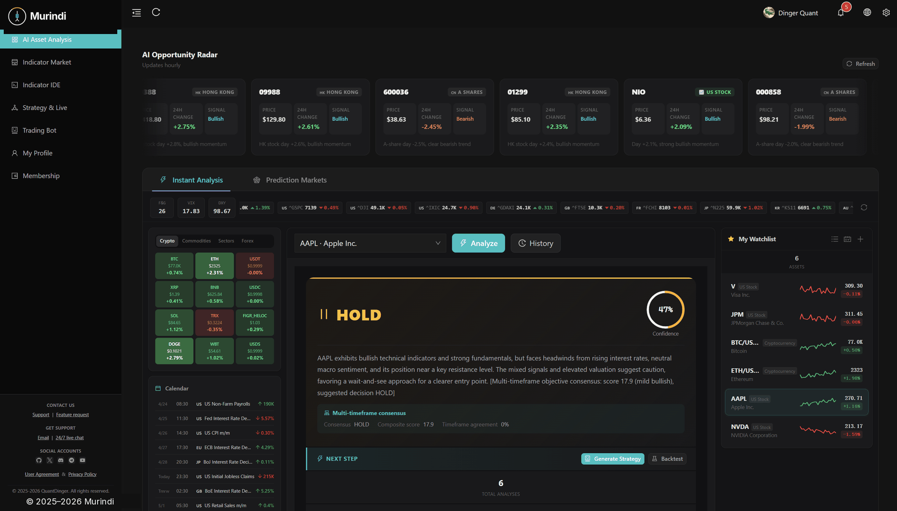
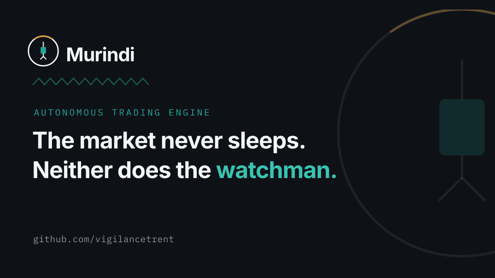
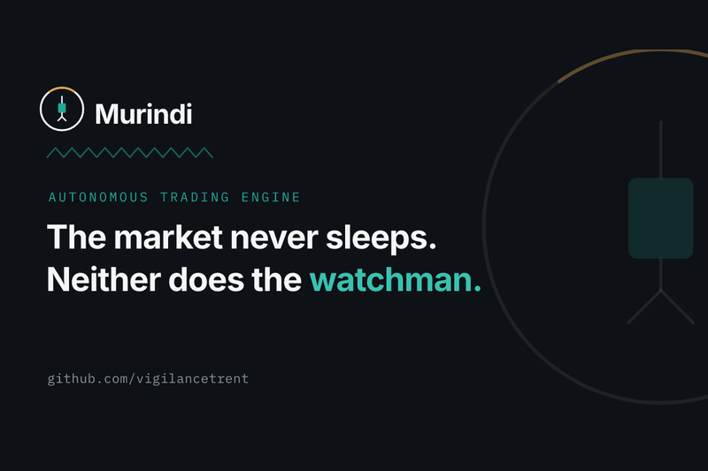
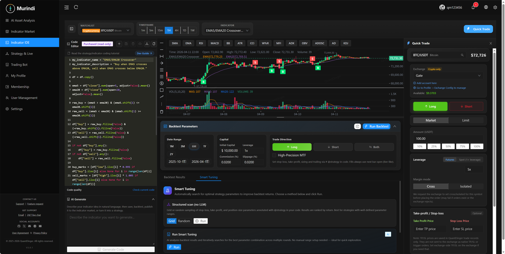
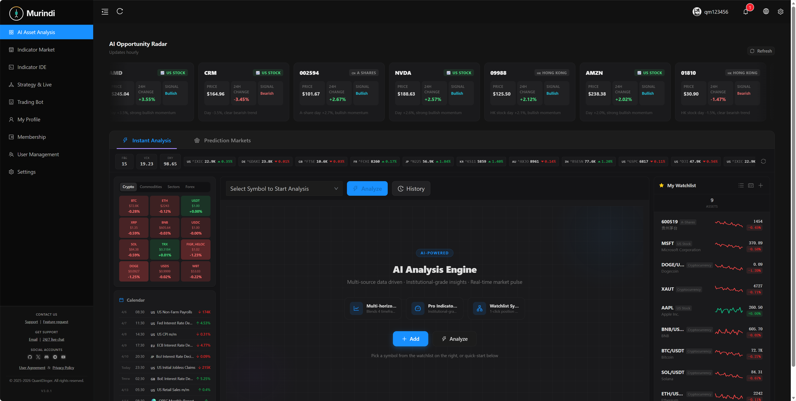
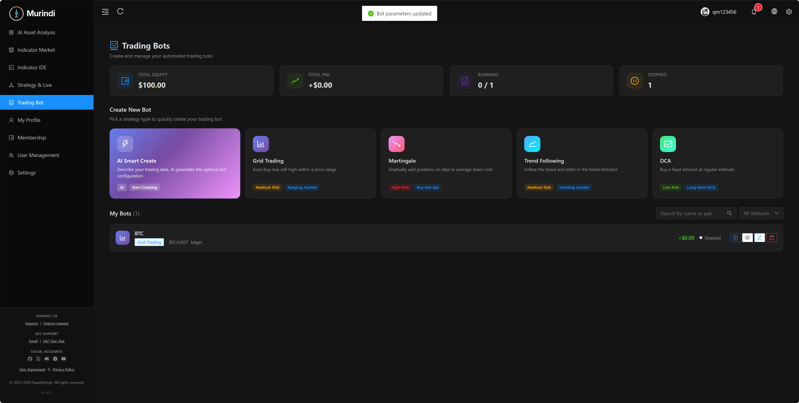
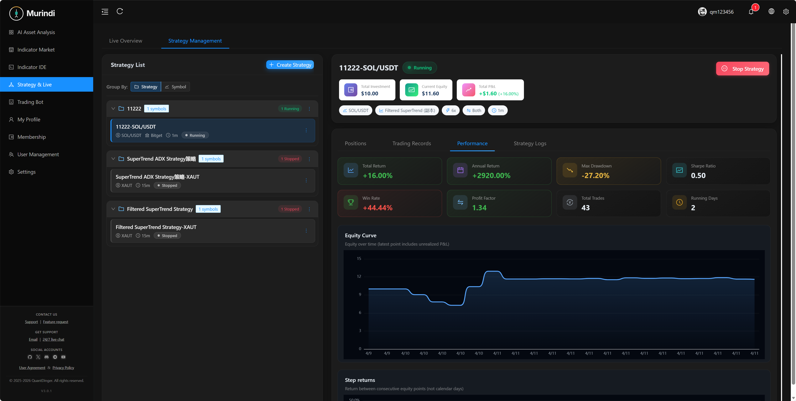

<div align="center">
  <a href="https://github.com/vigilancetrent/Murindi">
    
  </a>

  <h1>Murindi</h1>
  <h3>Hệ điều hành giao dịch định lượng AI riêng tư của bạn</h3>
  <p><strong>Một stack Docker cho biểu đồ, nghiên cứu đa LLM, chiến lược Python, backtest cấp tổ chức và live đa venue—tự host hoàn toàn, khóa của bạn, dữ liệu của bạn.</strong></p>
  <p><em>quant OS mã nguồn mở: AI hỗ trợ code → backtest → paper → live (crypto/IBKR/MT5/Alpaca), tích hợp Agent Gateway &amp; MCP.</em></p>

  <div align="center" style="max-width: 680px; margin: 1.25rem auto 0; padding: 20px 22px 22px; border: 1px solid #d1d9e0; border-radius: 16px;">
    <p style="margin: 0 0 14px; line-height: 1.65;">
      <a href="../README.md"><strong>English</strong></a>
      <span style="color: #afb8c1;"> · </span>
      <a href="README_CN.md"><strong>简体中文</strong></a>
      <span style="color: #afb8c1;"> · </span>
      <a href="README_JA.md"><strong>日本語</strong></a>
      <span style="color: #afb8c1;"> · </span>
      <a href="README_KO.md"><strong>한국어</strong></a>
      <span style="color: #afb8c1;"> · </span>
      <a href="README_TH.md"><strong>ไทย</strong></a>
      <span style="color: #afb8c1;"> · </span>
      <a href="README_VI.md"><strong>Tiếng Việt</strong></a>
      <span style="color: #afb8c1;"> · </span>
      <a href="README_AR.md"><strong>العربية</strong></a>
    </p>
    <p style="margin: 0 0 18px; padding-bottom: 16px; border-bottom: 1px solid #eaeef2; line-height: 2;">
      <a href="https://ai.murindi.com"><strong>SaaS</strong></a>
      <span style="color: #d8dee4;"> &nbsp;·&nbsp; </span>
      <a href="https://www.murindi.com"><strong>Trang web</strong></a>
      <span style="color: #d8dee4;"> &nbsp;·&nbsp; </span>
    </p>
    <p style="margin: 0; line-height: 2;">
      &nbsp;
      &nbsp;
      &nbsp;
    </p>
  </div>

  <p style="margin-top: 1.45rem; margin-bottom: 10px;">
    <a href="../LICENSE"></a>
    
    
    
    
    
    
  </p>
</div>

---

## Mục lục

[Bắt đầu nhanh](#bắt-đầu-nhanh) · [Điểm nổi bật kỹ thuật](#điểm-nổi-bật-kỹ-thuật) · [Kho liên quan](#kho-liên-quan) · [MCP / Agent](#mcp--agent-gateway) · [Tổng quan](#tổng-quan-sản-phẩm) · [Tính năng](#điểm-nổi-bật) · [Ảnh màn hình](#tour-hình-ảnh) · [Kiến trúc](#kiến-trúc) · [Cài đặt](#cài-đặt-và-chạy-lần-đầu) · [Tài liệu](#danh-sách-tài-liệu) · [FAQ](#câu-hỏi-thường-gặp) · [Giấy phép](#giấy-phép)

---

> Murindi là **quant OS tự lưu trữ, ưu tiên cục bộ** — không phải chatbot có nút mua. Gom **nghiên cứu đa LLM**, **chiến lược Python gốc**, **backtest phía server** và **live đa broker** (10+ crypto venue, IBKR, MT5, Alpaca) trong một stack production bạn kiểm soát hoàn toàn.

<div align="center">
  
  <p><sub><em>Từ zero đến chạy được—biểu đồ, AI nghiên cứu và workflow chiến lược trong vài phút.</em></sub></p>
</div>

<div align="center">
  
  <p><sub><em>Vòng lặp 5 tầng: <strong>Ý tưởng → Chỉ báo → Chiến lược → Backtest → Tối ưu → Thực thi → Giám sát</strong></em></sub></p>
</div>

## Điểm nổi bật kỹ thuật

| | Điểm khác biệt của Murindi |
|---|-------------------------------|
| **quant OS full-stack** | Biểu đồ, IDE, AI, backtest, bot live, quick trade, quản lý broker—một sản phẩm |
| **Agent-native** | **Agent Gateway** + PyPI [`murindi-mcp`](https://pypi.org/project/murindi-mcp/) — Cursor / Claude Code / Codex, audit log |
| **Hai runtime chiến lược** | `IndicatorStrategy` (tín hiệu vector) và `ScriptStrategy` (`on_bar`) |
| **Đa venue** | CCXT crypto, IBKR, MT5, Alpaca — trang tài khoản broker thống nhất |
| **Hạ tầng production** | PostgreSQL 16 + Redis 7, Worker, ảnh GHCR multi-arch |
| **Bảo mật** | Từ chối `SECRET_KEY` mặc định, token hash, mặc định chỉ paper |

## Bắt đầu nhanh

**Yêu cầu:** [Docker](https://docs.docker.com/get-docker/) + Compose v2. **Không cần Node.js** (kéo frontend từ GHCR).

### Cài đặt một dòng (Linux / macOS)

```bash
curl -fsSL https://raw.githubusercontent.com/vigilancetrent/Murindi/main/install.sh | bash
```

Mặc định `~/murindi`. Chạy lại để pull ảnh mới. → **`http://localhost:8888`** (`murindi` / `123456`, đổi mật khẩu ngay).

### Chuẩn: clone kho (macOS / Linux)

```bash
git clone https://github.com/vigilancetrent/Murindi.git && cd Murindi && cp backend_api_python/env.example backend_api_python/.env && chmod +x scripts/generate-secret-key.sh && ./scripts/generate-secret-key.sh && docker-compose up -d --build
```

Nếu không có `docker-compose`, dùng `docker compose`.

### Windows (PowerShell)

Bật **Docker Desktop**, rồi trong PowerShell:

```powershell
git clone https://github.com/vigilancetrent/Murindi.git
Set-Location Murindi
Copy-Item backend_api_python\env.example -Destination backend_api_python\.env
$key = & python -c "import secrets; print(secrets.token_hex(32))" 2>$null
if (-not $key) { $key = & py -c "import secrets; print(secrets.token_hex(32))" 2>$null }
if (-not $key) { Write-Error "Thêm Python 3 vào PATH." }
(Get-Content backend_api_python\.env) -replace '^SECRET_KEY=.*$', "SECRET_KEY=$key" | Set-Content backend_api_python\.env -Encoding utf8
docker-compose up -d --build
```

### Windows (Git Bash)

Trong Bash của Git for Windows có thể dùng lệnh một dòng như trên macOS/Linux.

---

Mở **`http://localhost:8888`**, đăng nhập **`murindi` / `123456`**, rồi **đổi mật khẩu quản trị ngay**. Chi tiết xem [Cài đặt và chạy lần đầu](#cài-đặt-và-chạy-lần-đầu).

## Kho liên quan

| Kho | Nội dung |
|-----|----------|
| **[Murindi](https://github.com/vigilancetrent/Murindi)** (kho này) | Backend, Compose, tài liệu, web đã build |
| **[Murindi-Vue](https://github.com/vigilancetrent/Murindi-Vue)** | **Mã nguồn web** (Vue) — tag `v*` tự động phát hành `ghcr.io/vigilancetrent/murindi-frontend` |
| **[Murindi-Mobile](https://github.com/vigilancetrent/Murindi-Mobile)** | **Ứng dụng di động** (mã nguồn mở) |

<h2 id="mcp--agent-gateway">MCP / Agent Gateway</h2>

Dành cho **Cursor / Claude Code / Codex**: **Model Context Protocol (MCP)** và **Agent Gateway** (`/api/agent/v1`). Tài liệu chi tiết bằng tiếng Anh là nguồn chính:

- **Hướng dẫn kết nối:** [**MCP_SETUP.md**](agent/MCP_SETUP.md) — Hosted / tự host, stdio cục bộ, HTTP từ xa, Claude Code CLI gộp trong một trang.
- [AGENT_QUICKSTART.md](agent/AGENT_QUICKSTART.md) · [AI_INTEGRATION_DESIGN.md](agent/AI_INTEGRATION_DESIGN.md) · [agent-openapi.json](agent/agent-openapi.json)
- Máy chủ MCP: [`../mcp_server/README.md`](../mcp_server/README.md) · PyPI [`murindi-mcp`](https://pypi.org/project/murindi-mcp/)

**Bảo mật:** Mọi lệnh gọi Agent được ghi vào nhật ký kiểm toán. Token giao dịch (T) mặc định chỉ **giấy**; giao dịch thực cần cả `AGENT_LIVE_TRADING_ENABLED=true` trên máy chủ và `paper_only=false` trên token.

## Tổng quan sản phẩm

Môi trường **AI + chiến lược Python + backtest + live** tự host. Thay bộ TradingView + Notebook + chat AI + bot sàn bằng **một stack Docker có thể kiểm toán**. Thông tin xác thực trong **PostgreSQL** và **`.env`**.

## Điểm nổi bật

- **Nghiên cứu & AI** — Đa LLM, NL→code, Agent / MCP (scoped token, SSE).
- **Xây dựng** — `IndicatorStrategy` / `ScriptStrategy`, UI K-line chuyên nghiệp.
- **Xác minh** — Backtest phía server (equity, drawdown, nhật ký lệnh).
- **Vận hành** — 10+ crypto, IBKR / MT5 / Alpaca, trang broker thống nhất, Telegram / Discord / Webhook.
- **Nền tảng** — Docker + GHCR, Postgres 16, Redis 7, OAuth, đa người dùng, billing, AWS Marketplace.

## Kiến trúc

**Nguyên tắc:** Tách dữ liệu thị trường · chiến lược/backtest · thực thi. Nginx + Vue SPA, Flask + Gunicorn, PostgreSQL 16, Redis 7. Triển khai: `install.sh` một dòng, GHCR zero-repo, full repo Compose, AWS AMI, [SaaS](https://ai.murindi.com).

## Tour hình ảnh

<table align="center" width="100%">
  <tr>
    <td colspan="2" align="center">
      
      
    </td>
  </tr>
  <tr>
    <td width="50%" align="center"><br/><sub>IDE chỉ báo, biểu đồ, kiểm thử lùi</sub></td>
    <td width="50%" align="center"><br/><sub>Phân tích tài sản bằng AI</sub></td>
  </tr>
  <tr>
    <td align="center"><br/><sub>Bot giao dịch</sub></td>
    <td align="center"><br/><sub>Chiến lược thực &amp; hiệu suất</sub></td>
  </tr>
</table>

## Cài đặt và chạy lần đầu

1. Clone rồi `cp backend_api_python/env.example backend_api_python/.env`
2. **Phải đặt `SECRET_KEY`** (giữ placeholder thì backend không khởi động). Linux/macOS: `./scripts/generate-secret-key.sh`
3. `docker-compose up -d --build`
   - **Tùy chọn (không cần clone repo)**: kéo image backend + frontend đa kiến trúc (amd64/arm64) sẵn từ GHCR:
     ```bash
     curl -O https://raw.githubusercontent.com/vigilancetrent/Murindi/main/docker-compose.ghcr.yml
     curl -o backend.env https://raw.githubusercontent.com/vigilancetrent/Murindi/main/backend_api_python/env.example
     docker compose -f docker-compose.ghcr.yml up -d
     ```
     Image mặc định: `ghcr.io/vigilancetrent/murindi-{backend,frontend}:latest`. Ghim đồng thời cả hai bằng `IMAGE_TAG=v3.0.9` trong `.env` cục bộ, hoặc ghim từng bên với `BACKEND_TAG` / `FRONTEND_TAG`.
   - **Phát triển frontend cục bộ**: clone `Murindi-Vue` vào `./Murindi-Vue/` (đã gitignore) rồi chạy `docker compose -f docker-compose.yml -f docker-compose.build.yml up -d --build`. Chi tiết xem [README tiếng Anh](../README.md#alternative-build-the-frontend-from-vue-source).
4. **Web:** `http://localhost:8888` · **Sức khỏe API:** `http://localhost:5000/api/health`
5. Đổi mật khẩu quản trị mặc định trước production. Đặt **`FRONTEND_URL`** trong `backend_api_python/.env` đúng URL thực tế.

Tính năng AI: sao chép mục **AI / LLM** từ `env.example` sang `.env`, rồi khởi động lại backend. Danh sách đầy đủ xem [README tiếng Anh](../README.md) hoặc [简体中文](README_CN.md).

## Danh sách tài liệu

| Tài liệu | Mô tả |
|----------|--------|
| [English README](../README.md) | Bản đầy đủ (Anh) |
| [简体中文](README_CN.md) | Bản đầy đủ (Tiếng Trung giản thể) |
| [CHANGELOG](CHANGELOG.md) | Lịch sử phiên bản |
| [Agent nhanh](agent/AGENT_QUICKSTART.md) (Anh) | Agent Gateway / ví dụ curl |
| [Hướng dẫn chiến lược (Anh)](STRATEGY_DEV_GUIDE.md) | Phát triển chiến lược chỉ báo·script |

Khác: [multi-user-setup.md](multi-user-setup.md) · [IBKR](IBKR_TRADING_GUIDE_EN.md) · [MT5](MT5_TRADING_GUIDE_EN.md) — chi tiết chủ yếu bằng tiếng Anh.

## Câu hỏi thường gặp

**Có thật sự tự host được không?** Có, triển khai bằng Docker Compose trên hạ tầng của bạn.

**Chỉ tiền mã hóa?** Không. Hỗ trợ IBKR / Alpaca (cổ Mỹ · ETF · tiền mã hóa) và MT5 (FX).

**Viết chiến lược bằng Python được không?** Có, hỗ trợ `IndicatorStrategy` và `ScriptStrategy`.

**Thương mại?** Backend **Apache 2.0**. Frontend [Murindi-Vue](https://github.com/vigilancetrent/Murindi-Vue) có giấy phép riêng—đọc kỹ trước khi dùng thương mại. Di động theo [Murindi-Mobile](https://github.com/vigilancetrent/Murindi-Mobile).

**Có ứng dụng di động không?** Xem [Murindi-Mobile](https://github.com/vigilancetrent/Murindi-Mobile).

## Liên kết giới thiệu sàn (tham khảo)

| Sàn | Liên kết |
|-----|----------|
| Binance | [Đăng ký](https://www.bsmkweb.cc/register?ref=MURINDI) |
| OKX | [Đăng ký](https://www.xqmnobxky.com/join/MURINDI) |
| Bybit | [Đăng ký](https://partner.bybit.com/b/DINGER) |

## Giấy phép

- Backend: **Apache License 2.0** ([`../LICENSE`](../LICENSE))
- Web UI đi kèm: phân phối dựng sẵn. Mã nguồn tại [Murindi-Vue](https://github.com/vigilancetrent/Murindi-Vue) (giấy phép riêng)
- Thương hiệu: [`../TRADEMARKS.md`](../TRADEMARKS.md)

## Tuyên bố miễn trừ

Murindi dành cho nghiên cứu, giáo dục và giao dịch tuân thủ **hợp pháp**. **Không phải tư vấn đầu tư.** Bạn tự chịu trách nhiệm khi sử dụng.

## Cộng đồng

- · [Issues](https://github.com/vigilancetrent/Murindi/issues)
- Email: [support@murindi.com](mailto:support@murindi.com)

## Xu hướng Star

[](https://star-history.com/#vigilancetrent/Murindi&Date)

## Lời cảm ơn

Cảm ơn cộng đồng mã nguồn mở: Flask, Pandas, CCXT, Vue.js, KLineCharts, ECharts và nhiều dự án khác.

<p align="center"><sub>Nếu hữu ích, hãy cho một ngôi sao trên GitHub.</sub></p>
